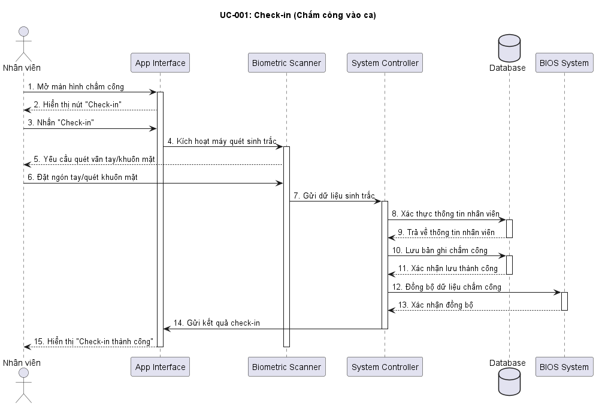
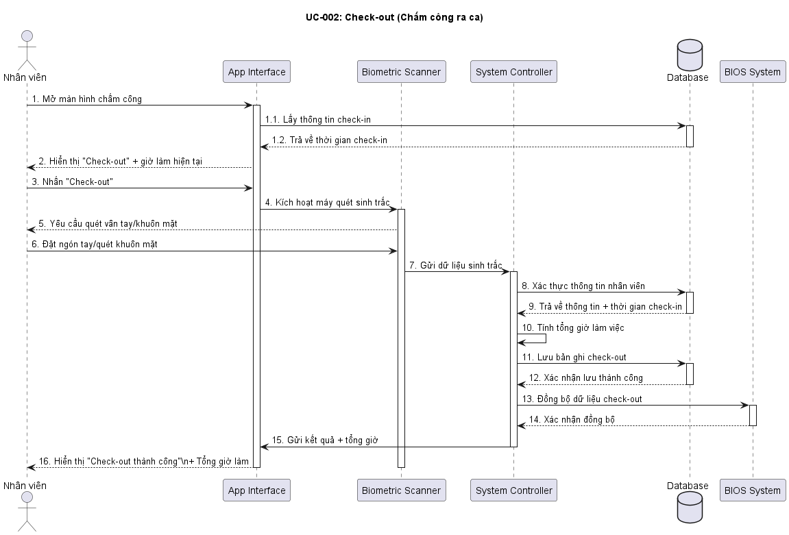
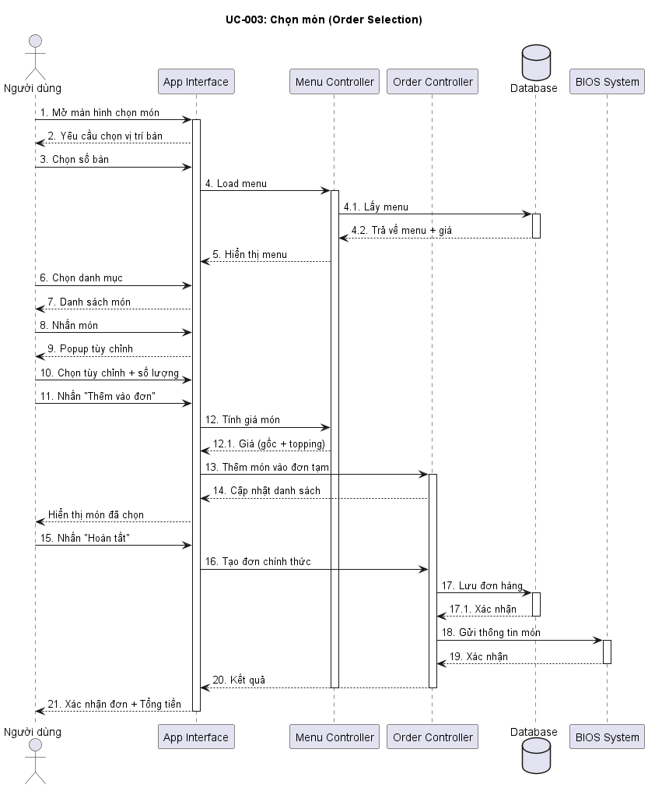

## Wondersea MIS

Hệ thống quản lý cho WONDERSEA BAR COFFEE, 
phục vụ quản lý nhân sự, chấm công, kho nguyên liệu 
và báo cáo vận hành.

## Mục tiêu
- Giảm thao tác thủ công
- Dễ dùng cho người không rành công nghệ
- Có thể mở rộng cho chuỗi F&B

## Phạm vi giai đoạn 1 (MVP)
- Quản lý nhân viên
- Chấm công
- Quản lý kho
- Báo cáo cơ bản

# Sequence Diagrams

## Attendance

## Order

